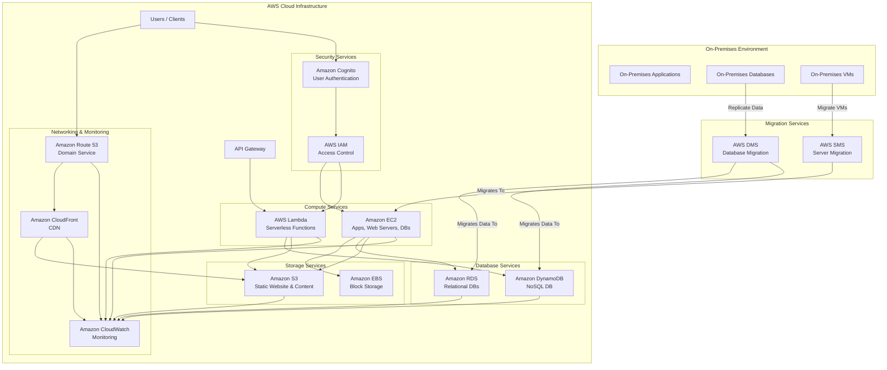

# Diagram Previews

## FreshlyGround Cafe AWS Architecture (Mermaid Diagram)

This diagram visualizes the AWS cloud architecture for FreshlyGround Cafe, including compute, storage, database, security, networking, monitoring, and migration services, as derived from the project instructions and checklist.

## Draw.io Diagram Example

To embed a Draw.io diagram (`.drawio` file) in a Markdown document, you typically need to export it to an image format (like SVG, PNG, or JPG) first. Then, you can embed that image using standard Markdown image syntax.

**Steps to Embed a Draw.io Diagram:**
1. Open your `aws-architecture.drawio` file in Draw.io.
2. Go to `File > Export as > SVG...` (or PNG/JPG).
3. Save the exported image (e.g., `aws-architecture.drawio.svg`) in your project directory (or an `images` subdirectory).
4. Reference the exported image in your Markdown file as shown below.

**Example (after exporting `aws-architecture.drawio` to `aws-architecture.drawio.svg`):**

*(Note: The image above will only display correctly after you have manually exported `aws-architecture.drawio` to `aws-architecture.drawio.svg` and placed it in the same directory as this Markdown file, or adjusted the path accordingly.)*
